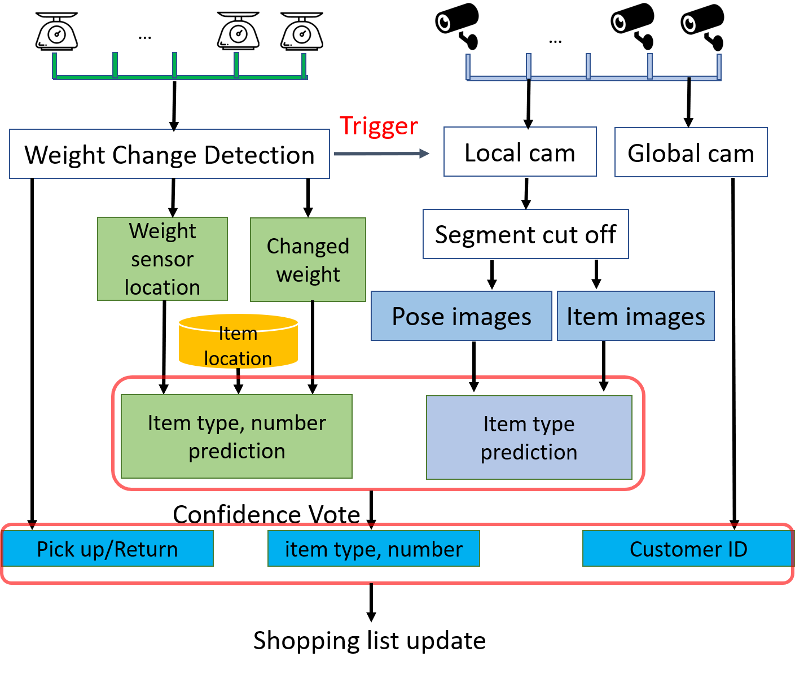

# CPSWeek Autocheckout Competition Team5

## System Architecture

Our system real-time processes two data streams: weight and vision sensor data. These two data streams are combined in different modules in our system as shown in Figure

### Weight change detection
We continuously monitor each weight sensor's reading. When the weight sensor detects a sudden change (anomaly detection), we consider a pick up or return occur. 
We calculate the weight change before and after the event. 
The output of the module include 1) event type (pick up v.s. return), 2) weight sensor location/ID, 3) the changed weight measured.
This event will also trigger the data processing of camera stream. 

### Local camera for item identification
We assign the camera whose view is pointing towards the shelf as local cameras. 
Once the system detects the change of weight sensors, the local camera associated to that weight sensor is awaken.
We detect the arm from the segment data, and utilize the hand pose for item images extraction.
We then use that segment of image for item recognition based on the item model trained with provided product datasets.
The output of this module is the item type.
\subsection{Global camera for customer identification}
We assign the camera whose view is mainly pointing towards the customer walking area as global cameras.
The global camera tracks the customer from the moment the person enters the store. 
The location association between the local and global camera view provides the customer ID for the item being picked up and returned.

### Item type and amount estimation
For the weight change detection module, we estimate the type and amount based on the weight sensor location and the associated item type to it. 
We divide the detected weight change by the item weight on the record as the estimated number. 
If the number is close to an integer, we assign a high confidence score, otherwise we assign a low confidence score considering there is significant noise.

For the local camera, we train a vision base  model with the provided product vision dataset. We conduct a partial image pattern matching (where the hand is not blocking the item) to the trained model, and the output is a prediction type and confidence level.

### Confidence vote
We conduct a confidence vote based on the score of the weight- and vision-based item type and amount estimation. 
The type that achieves the highest vote score is considered the final item type.
We further estimate the number of item by dividing the measured weight change by the item weight and round the value.

### Customer shopping list update
Based on the predicted result, the detected pickup and return type, as well as the customer ID, our system further update the Customer shopping list. 
For the pick up, the system add the corresponding number of recognized item to the customer's list.
For the return, the system searches the customer's current list and subtract the items.

## Getting Started

